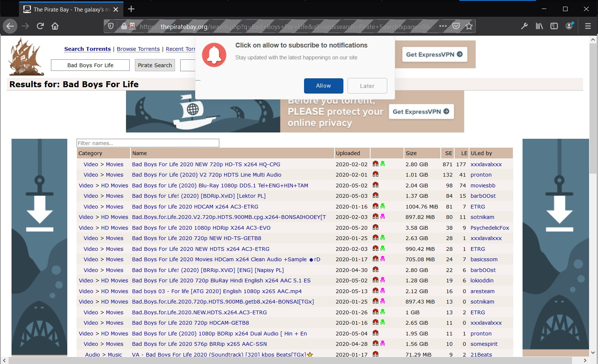
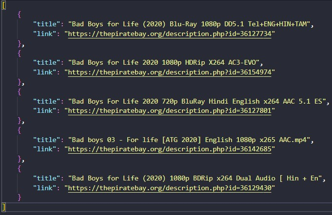

# WebScrapping on ThePirateBay to find HD movies

#### This project was made to find if there is a movie that could be in HD based on your data input.

## Run the project
### Geckodriver
To start it must be a folder with the *geckodriver.exe* to run the driver of the Firefox *(which is the WebDriver used in this project)*
You can download the driver in this link:
- https://github.com/mozilla/geckodriver/releases

After you download the *.exe*, change the directory in line 7 on the *executable_path* parameter of the *ws_piratebay.py* of your *geckodriver.exe* folder, like this:
```python
firefox = webdriver.Firefox(executable_path = 'F:\Bruno\Projects\Python\web_scrapping\python_ws_piratebay\geckodriver\geckodriver.exe')
```

### Selenium
The only libray used in this project its the *Selenium* so you must have do this command below:
```python
pip install selenium
```

### Finally...
To run the main file of the project, please:
```python
python .\ws_piratebay.py
```

## Screenshots
 First, type a movie name:
 <br>
 

 The *geckodriver* will show the website visited:
 <br>
 

 And then a list of links will show up in the output:
 <br>
 

 ## What you mean for 'movies in HD'?
 Its compared some keywords like '720p', '1080p' or even 'BluRay' to the titles of the links.
 <br>
 Later on will be added some new keywords that could be mean a movie in HD.


